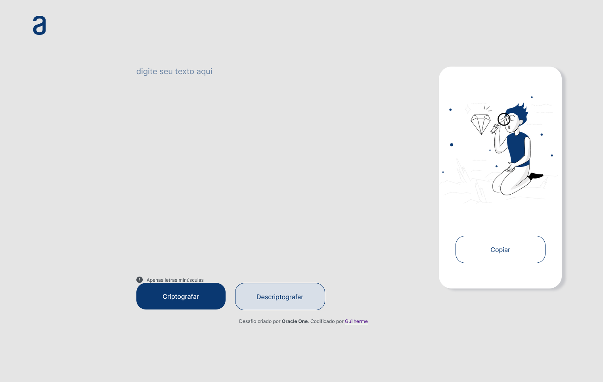

<h1 align="center"> Encriptador - Challenge Alura ONE T6 </h1>


### Link
<p><a href="https://munizgdm.github.io/challenges-oracle-one/" target=""_blank>Live Site URL</a></p>

## Construido com

- Semântica HTML5
- CSS3
- Flexbox
- JavaScript

### O que eu aprendi

```
HTML

Nomear classes de forma melhor;
Utilizar os elementos HTML de forma correta e entender o seu significado.
```

```
CSS

Separando as seções como cabeçalho, container, botões e etc...
Flexbox;
Position.
```

```
JavaScript

variaveis;
Funções;
Matriz;
Puxar o texto escrito pela interação do usuário e assim trasnformalo;
Interagir com botões;
Copiar/Cortar e colar.
```
### Próximos passos

A ideia é continuar melhorando a minha base de HTML5 organizando melhor as classes e utilizando os elementos da melhor forma, refinar o uso do flexbox e aprender mais sobre responsividade. 

